# 📘 Unit 1 - Generative AI Programs

This folder contains the Python programs and their corresponding outputs for **Unit 1 - Generative AI Lab**.

---

## Program 1 - Matplotlib Line Graph
**File:** `01_matplotlib_line_graph.py`

### Output

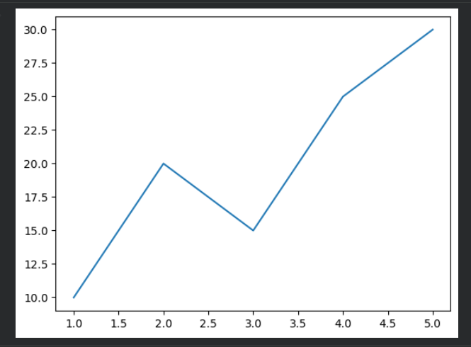

---

## Program 2 - Scikit-learn Version
**File:** `02_sklearn_version.py`

### Output

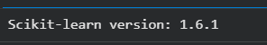

---

## Program 3 - NumPy Array
**File:** `03_numpy_array.py`

### Output

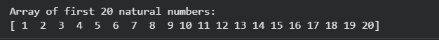

---

## Program 4 - Pandas DataFrame
**File:** `04_pandas_dataframe.py`

### Output

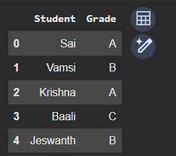

---

## Program 5 - Verify Installed Versions
**File:** `05_verify_versions.py`

### Output

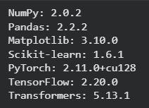

---

## Program 6 - PyTorch Tensors
**File:** `06_pytorch_tensors.py`

### Output

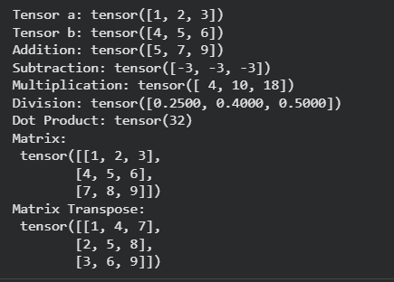

---

## Program 7 - Sentiment Analysis Pipeline
**File:** `07_sentiment_analysis_pipeline.py`

### Output

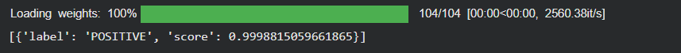

---

## Program 8 - BERT Tokenizer
**File:** `08_bert_tokenizer.py`

### Output

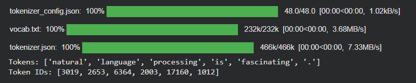

---

## Program 9 - GPT-2 Text Generation
**File:** `09_gpt2_text_generation.py`

### Output

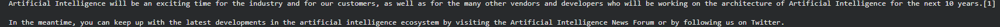

---

## Program 10 - Multi-class Sentiment Analysis
**File:** `10_sentiment_analysis_multi.py`

### Output

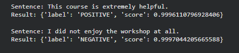

---

## Program 11 - BERT Tokenizer Encoding
**File:** `11_bert_tokenizer_encode.py`

### Output

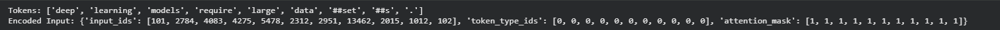

---

## Program 12 - BERT Embeddings
**File:** `12_bert_embeddings.py`

### Output

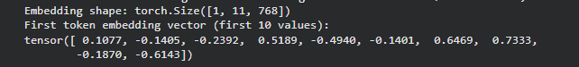

---

## Program 13 - GPT-2 Text Generation (Sampling)
**File:** `13_gpt2_generate_sampling.py`

### Output

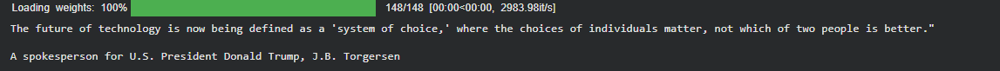

---

## Program 14 - Question Answering
**File:** `14_question_answering.py`

### Output

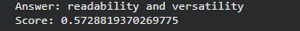

---

## Program 15 - Display BERT Tokens
**File:** `15_bert_tokens_display.py`

### Output

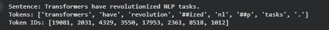

---

## Program 16 - Compare BERT & GPT-2 Tokenization
**File:** `16_compare_bert_gpt2_tokenization.py`

### Output

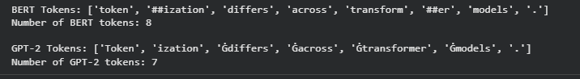

---

## Program 17 - BERT CLS Embedding
**File:** `17_bert_cls_embedding.py`

### Output

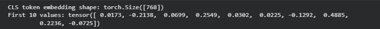

---

## Program 18 - Compare Embedding Similarity
**File:** `18_compare_embeddings_similarity.py`

### Output

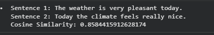

---

## Program 19 - GPT-2 Prompt Generation
**File:** `19_gpt2_generate_prompt.py`

### Output

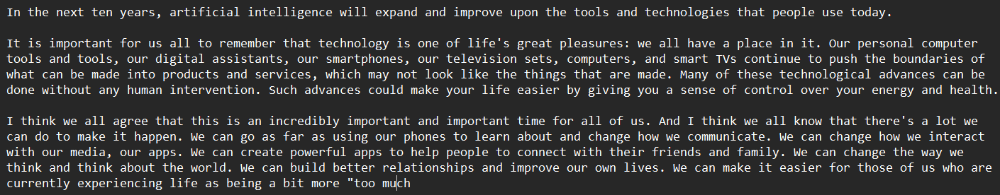

---

## Program 20 - Compare Multiple Prompts
**File:** `20_compare_multiple_prompts.py`

### Output

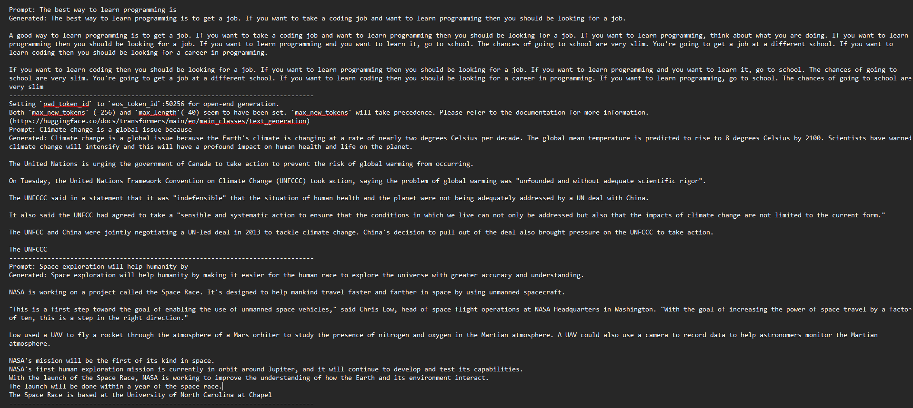