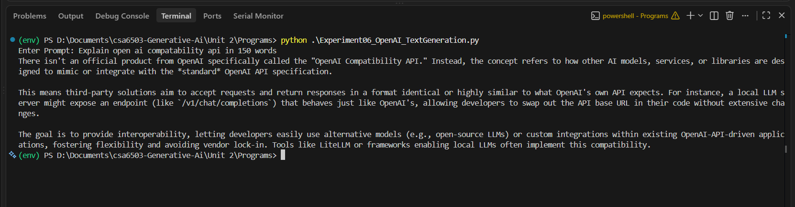
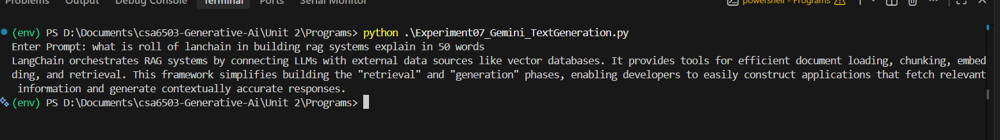
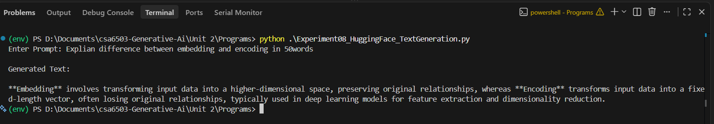

# 📘 Unit 2 - LLM APIs and Prompt Engineering Programs

This folder contains the Python programs and their corresponding outputs for **Unit 2 - Generative AI Lab**.

---

## Experiment 6 - Text Generation using OpenAI LLM API
**File:** `Experiment06_OpenAI_TextGeneration.py`

### Output

---

## Experiment 7 - Text Generation using Google Gemini LLM API
**File:** `Experiment07_Gemini_TextGeneration.py`

### Output

---

## Experiment 8 - Text Generation using Hugging Face Inference API
**File:** `Experiment08_HuggingFace_TextGeneration.py`

### Output

---

## Experiment 9 - Python Code Generation using Structured Prompting
**File:** `Experiment09_Python_Code_Generation.py`

### Output

See: `Outputs/exp9.txt`

---

## Experiment 10 - SQL Query Generation using Structured Prompting
**File:** `Experiment10_SQL_Query_Generation.py`

### Output

See: `Outputs/exp10.txt`

---

## Experiment 11 - Comparative Analysis of Zero-shot, One-shot and Few-shot Prompting
**File:** `Experiment11_Zero_One_Few_Shot.py`

### Output

See: `Outputs/exp11.txt`

---

## Experiment 12 - Prompt Evaluation, Comparison and Refinement using LLM Responses
**File:** `Experiment12_Prompt_Evaluation.py`

### Output

See: `Outputs/exp12.txt`

---

## Supporting Files

### `llm.py`
Common helper module used to communicate with the Gemini API.

### `.env`
Stores the Gemini and Hugging Face API keys. *(Not committed to GitHub.)*

### `.env.example`
Template file for adding API keys.

### `requirements.txt`
Contains the Python package dependencies required to run the experiments.

- google-genai
- huggingface_hub
- python-dotenv
