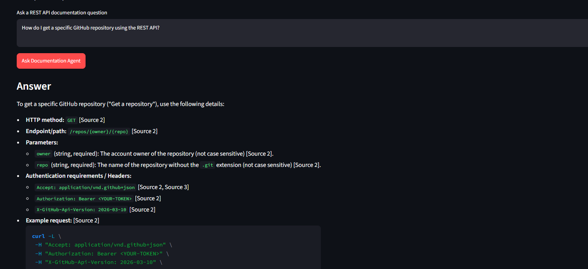
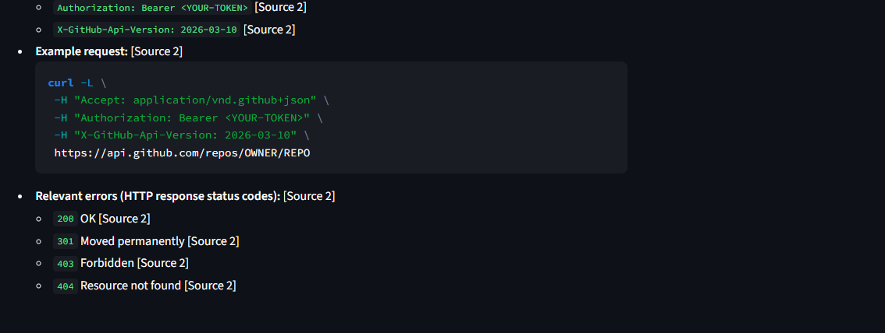
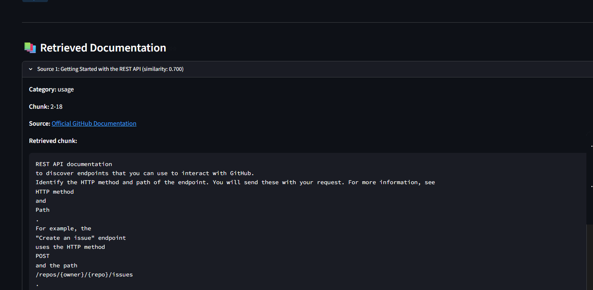

# REST API Documentation Agent

## AI-Powered RAG System for GitHub REST API Documentation

### Course

CSA6503 - Generative AI and Large Scale Models

### Assignment Question

**27. REST API Docs Agent**

Developers ask usage questions about an API's documentation.

Task:

Build a Document QA system over one public API's docs
(endpoints, auth, errors).

Demonstrate endpoint-usage queries and one query requiring
auth + endpoint sections together.

---

# 1. Project Overview

This project implements a Retrieval-Augmented Generation
(RAG) based documentation assistant for the GitHub REST API.

The system allows developers to ask questions about:

- REST API endpoints
- HTTP methods
- Parameters
- Authentication
- Permissions
- API versions
- Rate limits
- Errors
- Request examples

The system retrieves relevant documentation chunks from an
indexed corpus and provides them to a Large Language Model.

The answer is generated only from the retrieved context.

---


## Output









---

# 2. Architecture

```text
GitHub REST API Documentation
             |
             v
       Document Loader
             |
             v
       Text Cleaning
             |
             v
          Chunking
             |
             v
      Embedding Model
             |
             v
       FAISS Vector DB
             |
             |
       User Question
             |
             v
       Query Routing
             |
             v
      Semantic Retrieval
             |
             v
       Top-K Chunks
             |
             v
         Gemini LLM
             |
             v
    Grounded Answer + Sources